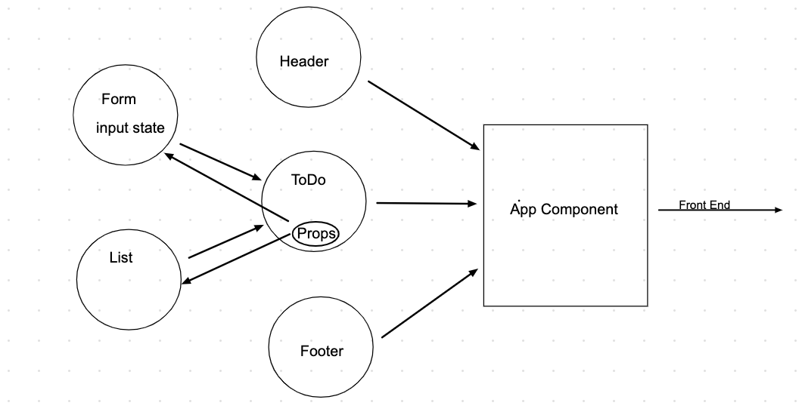

# Seattle Javascript-401d37

## To Do System Overview
A Web Application for securely managing a To Do List

## UML Diagram

## Phase 1 User Stories
-As a user, I would like an easy way to add a new to do item using an online interface
-As a user, I would like my to do items to have an assignee, due date, difficulty meter, status and the task itself
-As a user, I would like to delete to do items that are no longer needed
-As a user, I would like to easily mark to do items as completed
-As a user, I would like to edit an existing to do item

## Phase 2 User Stores
-As a user, I would like to be able to add, update, and delete To Do items
-As a user, I would like my To Do Items to be permanently stored so that I can re-access them at any time, using any device-

## Phase 3 User Stories
-As a user, I would like to see my To Do List Items a few at a time so that I don’t have to wade through them all
-As a user, I would like my default view to only be “Incomplete” Items so that I can quickly determine what I have to do.
-As a user, I would like my list sorted by difficulty so that I can more easily prioritize
-As a user, I would like the option to change my default preferences with regards to how many Items I see per page, which items are filtered, and how they are sorted

## Phase 4 User Stories
-As a user, I want to provide a way for other users to create new accounts
-As a user, I want to provide a way for all users to login to their account
-As a user, I want to make sure that my To Do items are only viewable to users that have logged in with a valid account.
-As a user, I want to ensure that only fellow users that are allowed to “create”, based on their user type, can add new To Do Items
-As a user, I want to ensure that only fellow users that are allowed to “update”, based on their user type, can mark To Do Items complete
-As a user, I want to ensure that only fellow users that are allowed to “delete”, based on their user type, can delete new To Do Items

## Technical Requirements
* React
* ES6 Classes
* User Login & Permissions
* Local Storage/Cookies for storing login status
* Local Storage/Cookies for storing user preferences
* Superagent of Axios for performing API requests
* React Bootstrap for styling
* TDD using Jest
* Deployment to cloud provider

## Available Scripts

In the project directory, you can run:

### `npm start`

Runs the app in the development mode. 
Open [http://localhost:3000](http://localhost:3000) to view it in the browser.

The page will reload if you make edits. 
You will also see any lint errors in the console.

### `npm test`

Launches the test runner in the interactive watch mode. 
See the section about [running tests](https://facebook.github.io/create-react-app/docs/running-tests) for more information.

### `npm run build`

Builds the app for production to the `build` folder. 
It correctly bundles React in production mode and optimizes the build for the best performance.

The build is minified and the filenames include the hashes. 
Your app is ready to be deployed!

See the section about [deployment](https://facebook.github.io/create-react-app/docs/deployment) for more information.

### `npm run eject`

**Note: this is a one-way operation. Once you `eject`, you can’t go back!**

If you aren’t satisfied with the build tool and configuration choices, you can `eject` at any time. This command will remove the single build dependency from your project.

Instead, it will copy all the configuration files and the transitive dependencies (webpack, Babel, ESLint, etc) right into your project so you have full control over them. All of the commands except `eject` will still work, but they will point to the copied scripts so you can tweak them. At this point you’re on your own.

You don’t have to ever use `eject`. The curated feature set is suitable for small and middle deployments, and you shouldn’t feel obligated to use this feature. However we understand that this tool wouldn’t be useful if you couldn’t customize it when you are ready for it.

## Learn More

You can learn more in the [Create React App documentation](https://facebook.github.io/create-react-app/docs/getting-started).

To learn React, check out the [React documentation](https://reactjs.org/).

### Code Splitting

This section has moved here: https://facebook.github.io/create-react-app/docs/code-splitting

### Analyzing the Bundle Size

This section has moved here: https://facebook.github.io/create-react-app/docs/analyzing-the-bundle-size

### Making a Progressive Web App

This section has moved here: https://facebook.github.io/create-react-app/docs/making-a-progressive-web-app

### Advanced Configuration

This section has moved here: https://facebook.github.io/create-react-app/docs/advanced-configuration

### Deployment

This section has moved here: https://facebook.github.io/create-react-app/docs/deployment

### `npm run build` fails to minify

This section has moved here: https://facebook.github.io/create-react-app/docs/troubleshooting#npm-run-build-fails-to-minify
